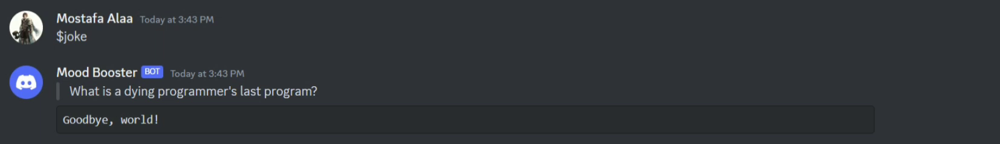
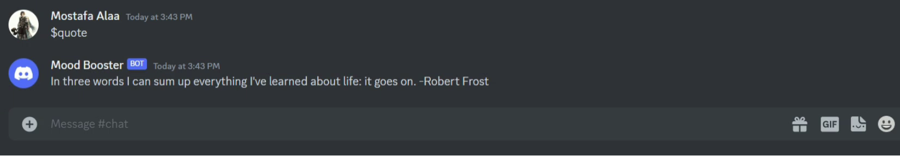
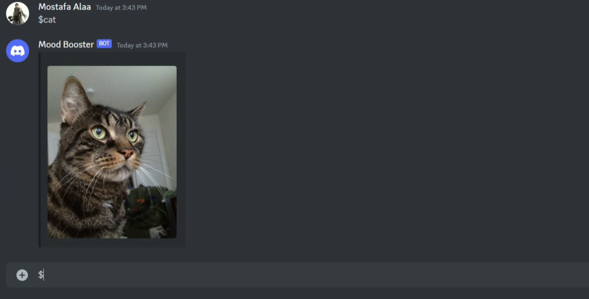
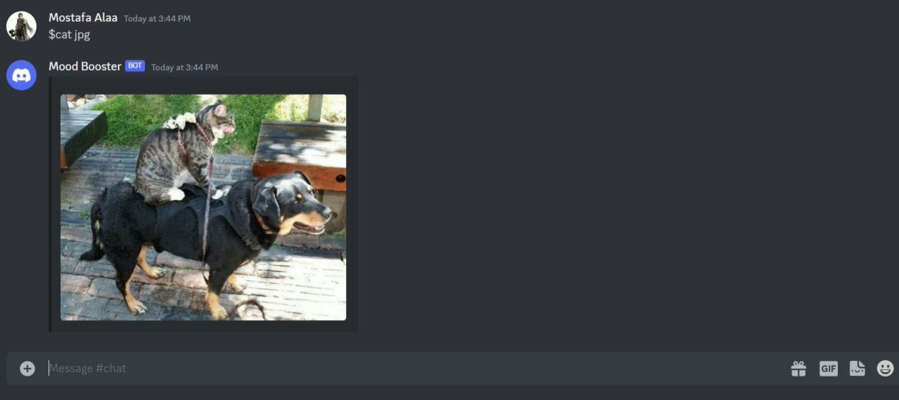
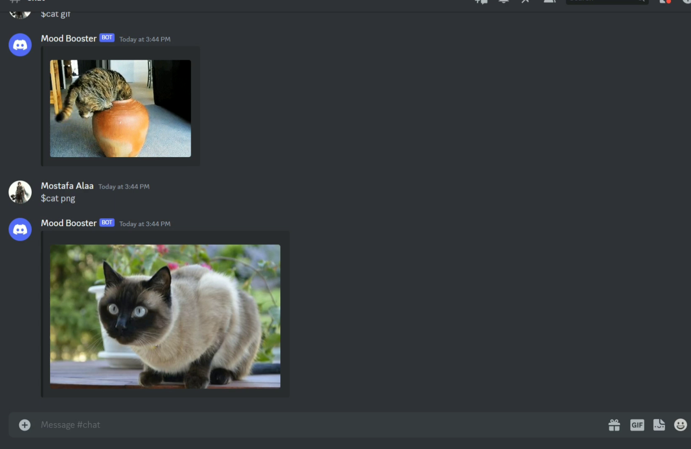
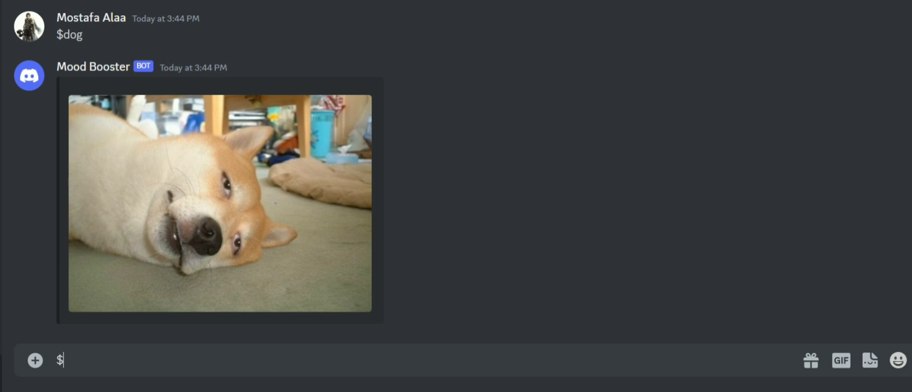
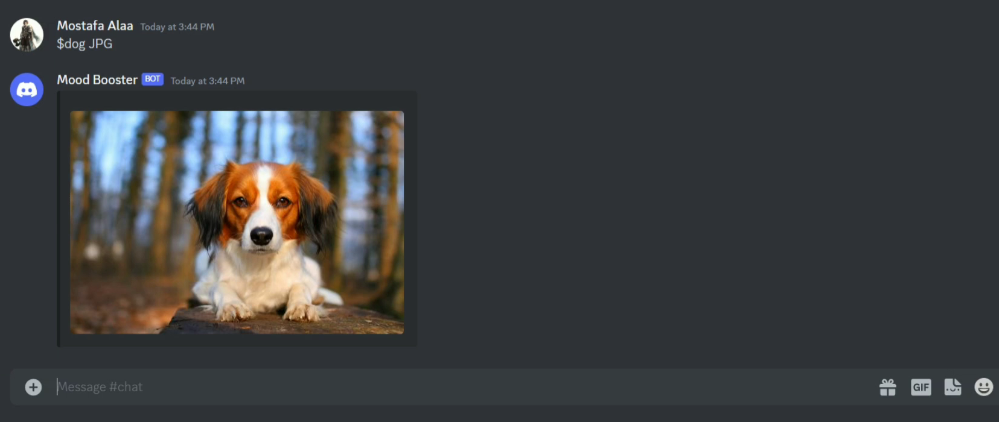
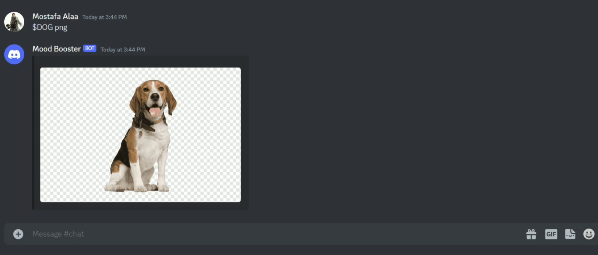
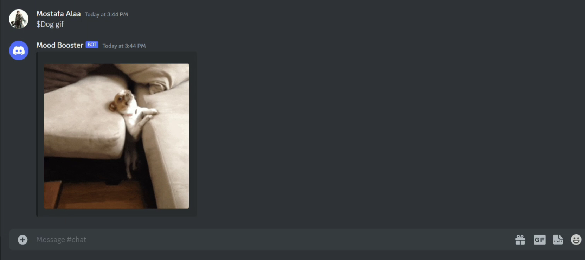

# MoodBooster - Discord Chatbot

MoodBooster is a Discord chatbot designed to boost your mood with jokes, advice, quotes, and adorable cat and dog pictures. It responds to commands and provides you with fun and uplifting content.

# Table of contents
- [Demo Video](#demo-video)
- [Features](#features)
- [Usage](#usage)
  - [Introduction](#introduction)
  - [Joke Command](#joke-command)
  - [Quote Command](#quote-command)
  - [Advice Command](#advice-command)
  - [Cat Command](#cat-command)
  - [Dog Command](#dog-command)
- [How It Works](#how-it-works)
- [Installation](#installation)
- [Dependencies](#dependencies)

## Demo Video

[Watch the MoodBooster demo video on YouTube](https://youtu.be/wCGPLVia_lw)

## Features

- Get random jokes to brighten your day.
- Receive helpful pieces of advice.
- Enjoy inspiring quotes.
- Delight in cute cat pictures (jpg, png, or gif).
- Smile at adorable dog pictures (jpg, png, or gif).

## Usage

To interact with MoodBooster, use the following commands:

- `$booster` or `I feel bad` or `I feel sad` or `I feel mad` (case insensitive): Get an introduction and instructions on how to use the bot.
  - Example usage: `$booster` or `I feel bad` or `I feel sad` or `I feel mad`
    
- `$joke`: Receive a random joke.
  - Example usage: `$joke`

- `$quote`: Get an inspiring quote.
  - Example usage: `$quote`

- `$advice`: Receive a piece of advice.
  - Example usage: `$advice`

- `$cat` (jpg | png | gif): Get an adorable cat picture in the specified format.
  - Example usage: `$cat jpg`

- `$dog` (jpg | png | gif): Enjoy an adorable dog picture in the specified format.
  - Example usage: `$dog gif`

Make sure to replace "7mostafaalaa" with your username in the bot's responses.

## How It Works

- Include images describing how each command works in the following format:

### Command: `$joke`

### Command: `$quote`

### Command: `$advice`

### Command: `$cat`

### Command: `$dog`

## Installation

To add MoodBooster to your Discord server, please follow these steps:
1. Click on the following link: https://discord.com/api/oauth2/authorize?client_id=1133869450626609254&permissions=429497248832&scope=bot
2. Review bot permissions, and grant the bot those permissions.
3. Enjoy the bot!

## Dependencies

- discord.js
- node-fetch
- express

Happy mood-boosting with MoodBooster! 🎉
